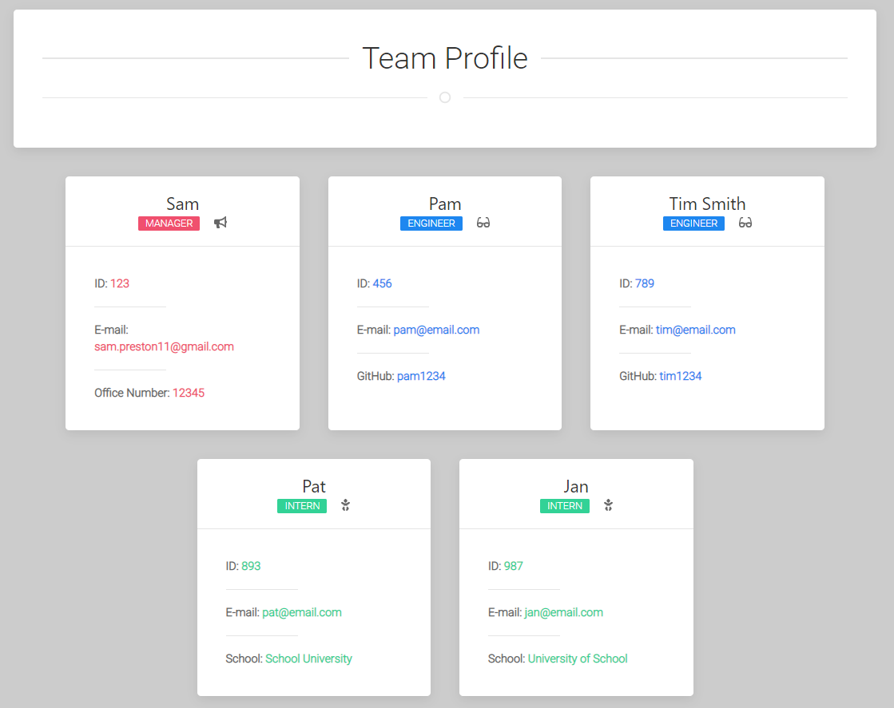
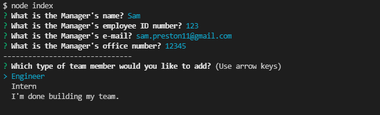

# Team Profile Generator


## Description

A Node.js command-line application that takes in information about employees on a software engineering team, then generates an HTML webpage that displays summaries for each person.



## Table of Contents

* [How To](#how-to)
* [Testing](#testing)
* [Technologies Used](#technologies-used)
* [User Story](#user-story)
* [Acceptance Criteria](#acceptance-criteria)
* [Contact Me](#contact-me)

## How To

* [Video walkthrough of this application's full functionality.](https://drive.google.com/file/d/19SUj--LJkRBeJfRZlNTsgoO1ANI3EG77/view)

* Navigate to the team-profile-generator directory and install dependencies by entering the following command in the console:
```
npm install
```
* Run the application by entering the following command into the console:
```
node index
```
* Answer pompts to build your team. You can add one Manager and an unlimited amount Engineers & Interns. Prompts are validated to ensure correct input.



* Select "I'm done building my team." to generate your HTML and CSS files. Files are generated in the 'dist' folder.


## Testing

To run unit tests, enter the following command in the console:
```
npm run test
```
If tests are successful, you will see the following displayed to the console:


## Technologies Used

Built in Visual Studio with:
* Node.js
* Javascript /jQuery
* Font Awesome Icons
* UI Kit / CSS
* HTML
* Inquirer
* Fs
* Jest

## User Story

```md
AS A manager
I WANT to generate a webpage that displays my team's basic info
SO THAT I have quick access to their emails and GitHub profiles
```

## Acceptance Criteria

```md
GIVEN a command-line application that accepts user input
WHEN I am prompted for my team members and their information
THEN an HTML file is generated that displays a nicely formatted team roster based on user input
WHEN I click on an email address in the HTML
THEN my default email program opens and populates the TO field of the email with the address
WHEN I click on the GitHub username
THEN that GitHub profile opens in a new tab
WHEN I start the application
THEN I am prompted to enter the team manager’s name, employee ID, email address, and office number
WHEN I enter the team manager’s name, employee ID, email address, and office number
THEN I am presented with a menu with the option to add an engineer or an intern or to finish building my team
WHEN I select the engineer option
THEN I am prompted to enter the engineer’s name, ID, email, and GitHub username, and I am taken back to the menu
WHEN I select the intern option
THEN I am prompted to enter the intern’s name, ID, email, and school, and I am taken back to the menu
WHEN I decide to finish building my team
THEN I exit the application, and the HTML is generated
```

## Contact Me

Questions, comments, or concerns about this project? Contact me at Github or via e-mail.

* GitHub: [spreston4](https://github.com/spreston4)

* E-mail: [sam.preston11@gmail.com](mailto:sam.preston11@gmail.com)

